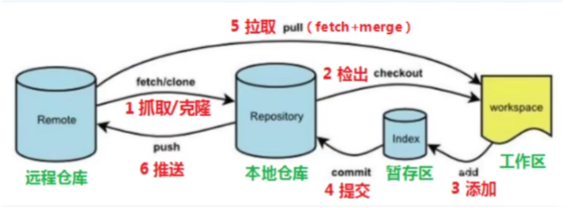
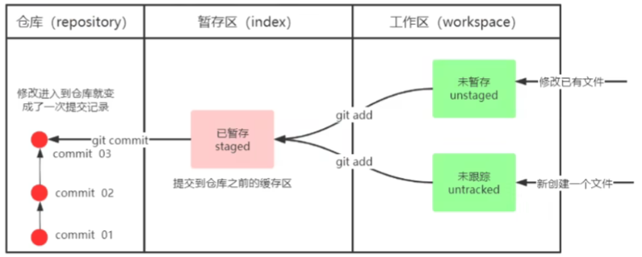
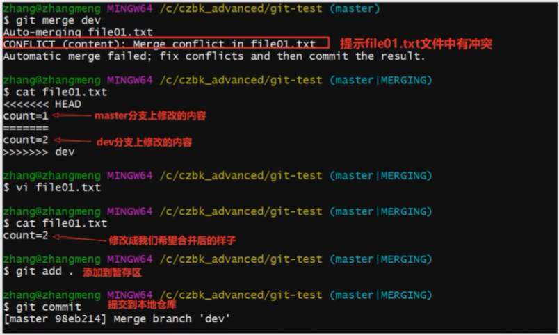
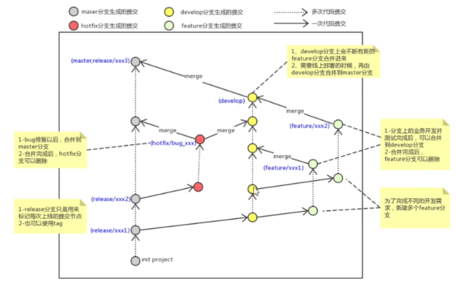
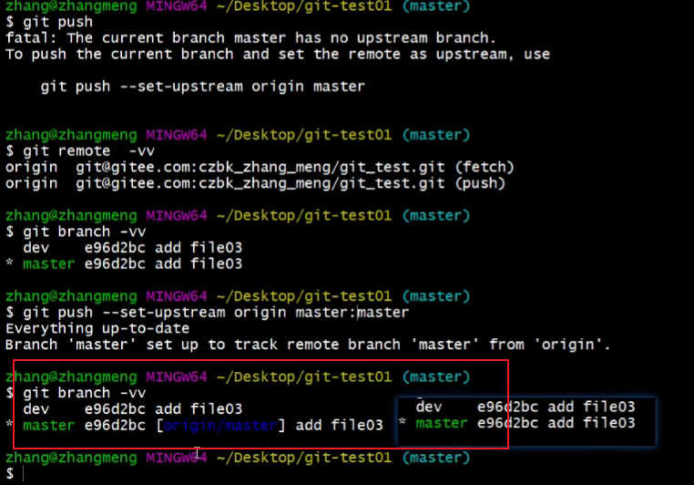
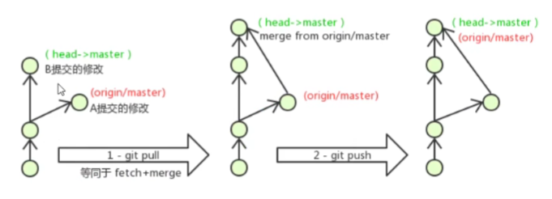

Git 工作流程
Git 常用命令
Git 代码托管服务
IDEA 中操作 Git


### Git 工作流程图



1. clone (克隆): 从远程仓库中克隆代码到本地仓库；
2. checkout (检出): 从本地仓库中检出一个仓库分支然后进行修订；
3. add (添加): 在提交前先将代码提交到暂存区；
4. commit (提交): 提交到本地仓库，本地仓库中保存修改的各个历史版本；
5. fetch (抓取): 从远程仓库，抓取到本地仓库，不进行任何的合并动作，一般操作比较少；
6. pull (拉取): 从远程仓库拉到本地仓库，自动进行合并（merge），然后放到工作区，相当于 fetch + merge；
7. push (推送): 修改完成后，需要和团队成员共享代码时，将代码推送到远程仓库；


设置用户信息
`git config --global user.name "user_name"`
`git config --global user.email "xxxx@123.com"`

查看配置信息
`git config --global user.name`
`git config --global user.email`

为常用命令设置别名
在用户目录创建 .bashrc
`touch ~/.bashrc`
输入如下内容
``` bash
# 用于输出 git 提交日志
alias git-log='git log --pretty=oneline --all --graph --abbrev-commit'
# 用于输出当前目录所有文件及基本信息
alias ll='ls -al'
```
打开 git bash，执行 `source ~/.bashrc`


解决 GitBash 乱码问题
打开 GitBash 执行如下命令
`git config --global core.quotepath false`
$(git_home)/etc/bash.bashrc 文件最后加入如下两行
```
export LANG="zh_CN.UTF-8"
export LC_ALL="zh_CN.UTF-8"
```

创建本地仓库
`git init  # 初始化当前目录为一个 git 仓库`
`ll  # 初始化完成后当前目录下会多一个 .git 文件夹`


基础操作命令
Git 工作目录下对于文件的修改（增加、删除、更新）会存在几个状态，这些修改的状态会随着执行 Git 命令而发生变化；


`git add` （工作区 --> 暂存区）
`git commit`    （暂存区 --> 本地仓库）


学习案例
``` bash
touch file01.txt
git status
git add file01.txt
git add .
git status
git commit -m "init commit"
git status
git log
code file01.txt
git status
git add .
git commit -m "update file01.txt"
git log
```

常用命令
```
# 查看修改的状态（status）
# 作用：查看修改的状态（暂存区、工作区）
# git status

# 添加工作区到暂存区（add）
# 作用：添加工作区一个或多个文件的修改到暂存区
# git add 单个文件名|通配符
# git add . 将所有修改加入暂存区

# 提交暂存区到本地仓库（commit）
# 作用：提交暂存区内容到本地仓库的当前分支
# git commit -m "注释内容"

# 查看日志提交（log）
# 查看提交记录
# git log [option]
# options
    # --all 显示所有分支
    # --pretty=oneline 将提交信息显示为一行
    # --abbrev-commit 使得输出的 commitid 更简短
    # --graph 以图的形式显示

# 版本回退
# 版本切换
# git reset --hard cimmitID
# commitID 可以使用 git log 指令查看
# 如何查看已经删除的记录
    # git reflog
    # 这个命令可以查看已经删除的提交记录

# 添加文件至忽略列表
# 对于无需纳入 Git 管理的文件，可以在工作目录中创建一个名为 .gitignore 的文件，列出要忽略的文件模式；
*.a
!lib.a
/TODO
build/
doc/*.txt
doc/**/*.pdf 
```

学习案例
``` bash
# 仓库初始化
# 创建文件夹，并在文件夹下打开 gitbash
# 初始化仓库
git init

# 创建并提交
# 目录下创建文件 file01.txt
# 将修改加入暂存区
git add .
# 将修改提交到本地仓库，提交记录内存为：commit 001
git commit -m 'commit 001'
# 查看日志
git log

# 修改文件并提交
# 修改 file01 的内容为: count = 1
# 将修改加入暂存区
git add .
# 将修改提交到本地仓库，提交记录内容为：update file01
git commit -m 'update file01'
# 查看日志
git log
# 以精简的方式显示提交记录
git-log

# 将最后一次修改还原
# 查看提交记录
git-log
# 找到倒数第 2 次提交的 commitID
# 版本回退
git reset --hard commitID
```


分支常用命令
``` bash
# 使用分支进行开发意味着开发者可以将工作从开发主线上分离开来进行重大的 Bug 修改、开发新的功能，以免影响开发主线；

# 查看本地分支
git branch

# 创建本地分支
git branch 分支名

# 切换分支 （checkout）
git checkout 分支名
# 此外该命令还可以直接切换到一个不存在的分支（创建并切换）
git checkout -b 分支名

# 合并分支 （merge）
一个分支上的提交可以合并到另一个分支
git merge 分支名称

# 删除分支
# 不能删除当前分支，只能删除其他分支
git branch -d b1 删除分支时，需要做各种检查
git branch -D b1 不做任何检查，强制删除

# 解决冲突
当两个分支上对文件的修改可能会存在冲突，例如同时修改了同一个文件的同一行，这时就需要手动解决冲突，解决冲突的步骤如下：
1. 处理文件中冲突的地方
2. 将解决完冲突的文件加入暂存区（add）
3. 提交到仓库（commit）
冲突部分的内容处理如下所示：
```


开发中分支使用原则与流程
在日常开发中，一般有如下分支使用原则与流程：
- master （生产）分支
    线上分支，主分支，中小规模项目作为线上运行的应用对应的分支；
- develop （开发）分支
    是从 master 创建的分支，一般作为开发部门的主要开发分支，如果没有其他并行开发不同期上线要求，都可以在此版本进行开发，阶段开发完成后，需要时合并到 master 分支，准备上线
- feature/xxx 分支
    从 develop 创建的分支，一般是同期并行开发，但不同期上线时创建的分支，分支上的研发任务完成后合并到 develop 分支
- hotfix/xxxx 分支
    从 master 分支派生的分支，一般作为线上 bug 修复使用，修复完成后需要合并到 master、test、develop 分支；
- 还有一些其他分支，如 test 分支（用于代码测试）、pre 分支（预上线分支）等等




学习案例——分支练习
``` bash
# 创建并切换到 dev01 分支，在 dev01 分支提交
git branch dev01
git checkout dev01
# 创建文件 file02.txt
git add .
git commit -m "add file02 on dev"
git-log

# 切换到 master 分支，将 dev01 合并到 master 分支
git checkout master
git merge dev01
git-log

# 删除 dev01 分支
git branch -d dev01
git-log
```

操作远程仓库
```
添加远程仓库
此操作是先初始化本地库，然后与已创建的远程库进行对接；
# 命令：git remote add <远端名称> <仓库路径>
# 远端名称：默认是 origin，取决于远端服务器设置
# 仓库路径：从远端服务器获取 URL

# 查看远程仓库
# 命令：git remote

# 推送到远程仓库
# 命令：git push [-f] [--set-upstream] [远端名称 [本地分支名]:[远端分支名]]
# 如果远程分支名和本地分支名一致，则可以只写本地分支名
    git push origin master
# -f 表示强制覆盖
# --set-upstream 推送到远端的同时并且建立起和远端分支的关联关系；
    git push --set-upstream orgin master
# 如果当前分支已经和远端分支关联，则可以省略分支名和远端名；
    git push  # 将 master 分支推送到已关联的远端分支

# 本地分支与远程分支的关联关系
# 查看关联关系可以使用 git branch -vv 命令

# 从远程仓库克隆
# 如果已经有一个远端仓库，可以直接 clone 到本地
git clone <仓库路径> [本地目录]
# 本地目录可以省略，会自动生成一个目录

# 从远程仓库中抓取和拉取
远程分支和本地分支一样，可以进行 merge 操作，只是需要先把远程仓库里的更新都下载到本地，再进行操作
git fetch [remote name] [branch name]
# 抓取指令就是将仓库里的更新都抓取到本地，不会进行合并
# 如果不指定远端名称和分支名，则抓取所有分支
git pull [remote name] [branch name]
# 拉取指令就是将远端仓库的修改拉到本地并自动进行合并，等同于 fetch+merge
# 如果不指定远端名称和分支名，则抓取所有并更新当前分支

# 解决合并冲突
# 在一段时间，A、B 用户修改了同一个文件，且修改了同一行位置的代码，此时发生合并冲突；
# A 用户在本地修改代码后优先推送到远程仓库，此时 B 用户在本地修改代码，提交到本地仓库后，也需要推送到远程仓库，此时 B 用户晚于 A 用户，故需要先拉取远程仓库的提交，经过合并后才能推送到远端分支
# 在 B 用户拉取代码时，因为 A、B 用户同一段时间修改了同一个文件的相同位置代码，故会发生合并冲突；
# 远程分支也是分支，所以合并时冲突的解决方式也和解决本地分支冲突相同；
```





学习案例——远程仓库操作
```
# 将本地仓库推送到远程仓库 [git_test01]
# 添加远程仓库
git remote add origin git@github.com/**/**.git
# 将 master 分支推送到远程仓库，并与远程仓库的 master 分支绑定关联关系
git push --set-upstream origin master

# 将远程仓库克隆到本地 [git test02]
git clone git@github.com/**/**.git git_test01
# 以精简的方式显示提交记录
git-log

# 将本地修改推送到远程仓库 [git_test01]
# 创建文件 file03.txt
# 将修改加入暂存区并提交到仓库，提交记录内容为：add file03
git add .
git commit -m "add file03"
# 将 master 分支的修改推送到远程仓库
git push origin master

# 将远程仓库的修改更新到本地 [git_test02]
# 将远程仓库修改再拉取到本地
git pull
# 以精简的方式显示提交记录
git-log
# 查看文件变化（目录下也出现了 file03.txt）

```

**<font color="red">几条铁令</font>**
1. 切换分支前先提交本地的修改
2. 代码及时提交，提交过了就不会丢
3. 遇到任何问题都不要删除文件目录


## Reference:
PyCharm 配置 Git：[Click](https://www.bilibili.com/video/BV1MU4y1Y7h5/?p=23&spm_id_from=pageDriver&vd_source=6164de2a185f949293fb3064a50fdb40)